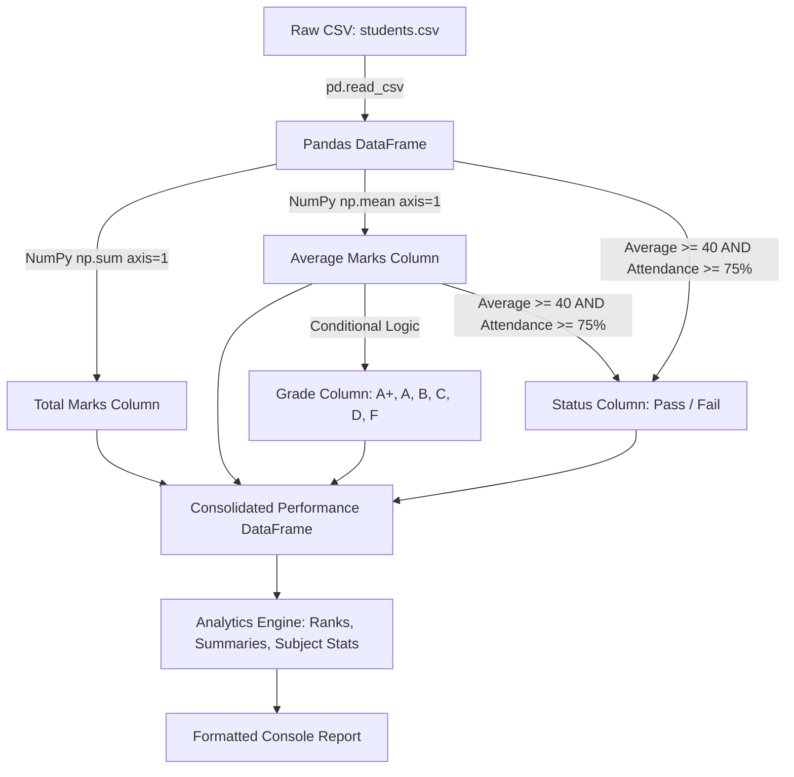

# Comprehensive Project Documentation
## Student Performance Analytics System

---

## 1. Project Title
**Student Performance Analytics System**  
*A Python Data Analysis and Academic Performance Reporting System*

---

## 2. Objective
The goal of this project is to develop a lightweight, transparent, and accurate academic analytics system in Python. It demonstrates foundational programming skills in data ingestion, numerical computation, and tabular manipulation using **Python 3**, **NumPy**, and **Pandas**.

The system automates the following key academic evaluation tasks:
1. Reading and validating raw student records from a CSV file.
2. Calculating total aggregate marks and subject average marks for every student.
3. Classifying students into standardized academic letter grades (`A+` to `F`).
4. Evaluating academic and regulatory pass/fail eligibility based on both scores and attendance.
5. Detecting individual highlights: Highest performing student, lowest performing student, and top 5 rank holders.
6. Computing institutional statistics: Overall class average, subject-wise averages, and attendance distributions.
7. Generating an executive console summary and a final consolidated student performance table.

---

## 3. Technologies Used

| Technology / Library | Version / Category | Role in Project |
| :--- | :--- | :--- |
| **Python** | 3.11+ | Primary programming language implementing logic, flow control, functions, and error handling. |
| **Pandas** | 2.x / 3.x | Tabular data manipulation: CSV reading, DataFrame structuring, column transformations, sorting, and filtering. |
| **NumPy** | 1.x / 2.x | High-speed numerical calculations: Vectorized summation (`np.sum`), mean calculation (`np.mean`), rounding (`np.round`), and array index searches (`np.argmax`, `np.argmin`). |
| **CSV** | Plain Text Format | Lightweight, portable storage for student marks and attendance records. |

> **Design Choice for Viva**: Complex frameworks like Django, Flask, or Machine Learning models were explicitly omitted. This ensures clean, explainable, and deterministic code that directly showcases Python data fundamentals.

---

## 4. Dataset Description

The system processes `students.csv`, a dataset containing **25 realistic student records** representing undergraduate students across various engineering and computing departments.

### Attribute Breakdown:
- **`Student_ID`** (Integer): Unique enrollment identifier assigned to each student (e.g., `101`, `102`).
- **`Name`** (String): Full student name.
- **`Department`** (String): Academic department (`Computer Science`, `Information Technology`, `Artificial Intelligence`, `Data Science`).
- **`Maths`** (Integer/Float): Marks obtained in Mathematics out of 100.
- **`Python`** (Integer/Float): Marks obtained in Python Programming out of 100.
- **`DBMS`** (Integer/Float): Marks obtained in Database Management Systems out of 100.
- **`Attendance`** (Integer/Float): Cumulative semester attendance percentage (0% to 100%).

### Dataset Sample (First 5 Rows):
```csv
Student_ID,Name,Department,Maths,Python,DBMS,Attendance
101,Amit Yadav,Computer Science,92,95,88,94
102,Priya Singh,Information Technology,89,91,90,92
103,Rohit Kumar,Artificial Intelligence,84,88,85,88
104,Anjali Sharma,Computer Science,82,85,87,90
105,Shivam Verma,Data Science,80,84,82,86
```

---

## 5. Implementation Architecture

The project adheres to a clean, modular two-file design pattern:

```text
Student-Performance-Analytics/
│
├── main.py                    # Orchestrator / Entry point
├── functions.py               # Pure logic / Analytical engine
├── students.csv               # Raw dataset
├── README.md                  # Quick-start manual
└── Project_Documentation.md   # Detailed viva documentation
```

### Flow of Execution:
1. `main.py` is executed in the terminal.
2. `functions.load_student_data()` reads `students.csv`, validates column integrity, ensures numeric types, and converts it to a Pandas DataFrame.
3. `functions.process_student_data()` performs vectorized calculations using NumPy to compute `Total_Marks` and `Average_Marks`.
4. Functions `assign_grade()` and `check_pass_fail()` evaluate performance row by row.
5. Analytical functions calculate subject summaries, rank top 5 students, identify highest/lowest performers, and filter attendance anomalies.
6. Clean, readable reports and the full final DataFrame are rendered to the console.

---

## 6. Key Features

1. **Defensive Data Ingestion**:
   - Handles missing CSV files with clear user feedback.
   - Handles empty files and structural corruption gracefully.
   - Coerces dirty inputs to numeric values and cleans invalid records.

2. **Accurate Numerical Computation**:
   - Zero hardcoded manual arithmetic; all mathematics is executed via NumPy arrays.

3. **Multi-Condition Decision Making**:
   - Enforces business rules combining academic benchmarks with institutional compliance rules.

4. **Multi-Subject Comparative Analytics**:
   - Dynamically analyzes performance variations between subjects (Maths vs. Python vs. DBMS).

5. **Actionable Institutional Insights**:
   - Instantly exposes students who are academically failing or at attendance risk.

---

## 7. Data Processing Workflow

The pipeline transforms raw marks into processed academic records through four clear stages:



---

## 8. NumPy Usage

NumPy is used directly for heavy numerical processing across multidimensional arrays:

| NumPy Function | Code Usage | Purpose & Viva Explanation |
| :--- | :--- | :--- |
| **`df[...].to_numpy()`** | `df[['Maths', 'Python', 'DBMS']].to_numpy()` | Extracts Pandas DataFrame columns into a contiguous 2D NumPy array for fast numerical computation. |
| **`np.sum(array, axis=1)`** | `np.sum(marks_array, axis=1)` | Computes the horizontal row-wise sum across the 3 subjects for every student. |
| **`np.mean(array, axis=1)`** | `np.mean(marks_array, axis=1)` | Computes row-wise arithmetic mean across subjects to calculate each student's average percentage. |
| **`np.round(array, 2)`** | `np.round(np.mean(...), 2)` | Formats floating-point numbers to two decimal places cleanly. |
| **`np.mean(1D_array)`** | `np.mean(df['Average_Marks'].to_numpy())` | Calculates the overall class average and average attendance across the entire cohort. |
| **`np.argmax(array)`** | `int(np.argmax(avg_marks))` | Returns the index of the student holding the highest average score. |
| **`np.argmin(array)`** | `int(np.argmin(avg_marks))` | Returns the index of the student holding the lowest average score. |
| **`np.max()` & `np.min()`** | `np.max(marks)`, `np.min(marks)` | Finds the highest and lowest scores obtained in individual subjects. |

---

## 9. Pandas Usage

Pandas manages dataset structure, tabular representation, and querying:

| Pandas Feature | Code Usage | Purpose & Viva Explanation |
| :--- | :--- | :--- |
| **`pd.read_csv()`** | `pd.read_csv(file_path)` | Ingests the CSV file into a DataFrame table in memory. |
| **`df.shape`** | `raw_df.shape[0]`, `raw_df.shape[1]` | Returns the count of rows and columns. |
| **`df.columns`** | `df.columns.tolist()` | Retrieves and validates dataset attribute names. |
| **`df.head()`** | `raw_df.head()` | Displays the top 5 records for fast dataset inspection. |
| **`pd.to_numeric()`** | `pd.to_numeric(df[col], errors='coerce')` | Safely parses marks and attendance into valid numbers. |
| **`df.copy()`** | `processed_df = df.copy()` | Creates an independent DataFrame copy to prevent accidental mutations. |
| **Column Creation** | `df['Total_Marks'] = ...` | Appends derived analytical attributes to the table. |
| **`df.sort_values()`** | `df.sort_values(by='Average_Marks', ascending=False)` | Sorts all students from highest average to lowest average. |
| **Boolean Indexing** | `df[df['Attendance'] < 75]` | Filters and isolates students violating the attendance threshold. |
| **Display Options** | `pd.set_option('display.max_columns', None)` | Ensures tables print without truncated columns in terminal. |

---

## 10. Reusable Functions in `functions.py`

Every analytical requirement is encapsulated within dedicated, single-responsibility functions:

### 1. `load_student_data(file_path)`
- **Input**: Path to CSV file (`str`).
- **Output**: Validated `pd.DataFrame`.
- **Logic**: Verifies file existence, tests against empty files, checks required columns (`Student_ID`, `Name`, `Department`, `Maths`, `Python`, `DBMS`, `Attendance`), and converts numerical columns safely.

### 2. `calculate_total_marks(df, subject_columns)`
- **Input**: DataFrame and list of subject column names.
- **Output**: 1D NumPy array of row-wise sums.
- **Formula**: $\text{Total} = \text{Maths} + \text{Python} + \text{DBMS}$.

### 3. `calculate_average_marks(df, subject_columns)`
- **Input**: DataFrame and subject columns.
- **Output**: 1D NumPy array of row-wise means rounded to 2 decimal places.
- **Formula**: $\text{Average} = \frac{\text{Total}}{3}$.

### 4. `assign_grade(average_mark)`
- **Input**: Student average mark (`float`).
- **Output**: Letter grade (`str`: `A+`, `A`, `B`, `C`, `D`, `F`).
- **Logic**: Multi-branch conditional ladder (`if-elif-else`).

### 5. `check_pass_fail(average_mark, attendance)`
- **Input**: Average marks (`float`) and attendance (`float`).
- **Output**: `'Pass'` or `'Fail'`.
- **Logic**: Evaluates `average_mark >= 40 and attendance >= 75`.

### 6. `process_student_data(df)`
- **Input**: Raw DataFrame.
- **Output**: Complete DataFrame with `Total_Marks`, `Average_Marks`, `Grade`, and `Status` columns appended.

### 7. `get_highest_performing_student(df)`
- **Input**: Processed DataFrame.
- **Output**: Dictionary containing details of the topper.
- **Logic**: Locates index via `np.argmax(df['Average_Marks'].to_numpy())`.

### 8. `get_lowest_performing_student(df)`
- **Input**: Processed DataFrame.
- **Output**: Dictionary containing details of the lowest performer.
- **Logic**: Locates index via `np.argmin(df['Average_Marks'].to_numpy())`.

### 9. `get_overall_class_average(df)`
- **Input**: Processed DataFrame.
- **Output**: Cohort average marks (`float`).
- **Logic**: `np.round(np.mean(df['Average_Marks'].to_numpy()), 2)`.

### 10. `get_top_students(df, top_n=5)`
- **Input**: Processed DataFrame, number of students desired (`int`).
- **Output**: Sliced DataFrame of top-performing students sorted descending by `Average_Marks`.

### 11. `subject_analysis(df, subjects)`
- **Input**: DataFrame and subject list.
- **Output**: Dictionary detailing mean, max, and min per subject, plus highest and lowest scoring subjects.

### 12. `attendance_analysis(df, threshold=75.0)`
- **Input**: DataFrame and attendance cutoff.
- **Output**: Dictionary with overall average attendance, list of low-attendance students, and count.

### 13. `pass_fail_summary(df)`
- **Input**: Processed DataFrame.
- **Output**: Total students, passed count, failed count, and pass percentage.

---

## 11. Grading System

| Average Marks Range | Grade | Description | Academic Standing |
| :---: | :---: | :--- | :--- |
| **90% - 100%** | **A+** | Outstanding | Distinction |
| **80% - 89.99%** | **A** | Excellent | First Class with Distinction |
| **70% - 79.99%** | **B** | Very Good | First Class |
| **60% - 69.99%** | **C** | Good | Second Class |
| **50% - 59.99%** | **D** | Average | Third Class / Pass Division |
| **Below 50%** | **F** | Fail | Needs Improvement / Re-examination |

---

## 12. Pass / Fail Logic

The system strictly enforces dual academic and regulatory criteria:

```python
if average_mark >= 40 and attendance >= 75:
    return 'Pass'
else:
    return 'Fail'
```

### Why Both Conditions are Crucial:
1. **Academic Standard (Average $\ge$ 40%)**: Ensures the student demonstrates minimum competence across coursework.
2. **Attendance Standard (Attendance $\ge$ 75%)**: Enforces university attendance policy compliance.

### Practical Case Studies from Dataset:
- **Case 1 (Standard Pass)**: Amit Yadav has 91.67% average and 94% attendance $\rightarrow$ **`Pass`**.
- **Case 2 (Academic Failure)**: Gaurav Bhatt has 38.33% average and 80% attendance $\rightarrow$ **`Fail`** (Failed on marks).
- **Case 3 (Attendance Failure despite High Marks)**: Divya Chawla has 82.67% average (Grade A) but only 70% attendance $\rightarrow$ **`Fail`** (Disqualified due to attendance deficit).
- **Case 4 (Double Failure)**: Rahul Kumar has 32.33% average and 62% attendance $\rightarrow$ **`Fail`** (Failed both criteria).

---

## 13. Analysis Results on the Dataset

When analyzed on the 25 student records, the system generated the following verified metrics:

- **Total Students Analyzed**: 25
- **Overall Class Average**: 70.24%
- **Passed Students**: 21 (84.0%)
- **Failed Students**: 4 (16.0%)
- **Highest Performing Student**: **Amit Yadav** (Computer Science) - **91.67%** (Grade `A+`)
- **Lowest Performing Student**: **Rahul Kumar** (Computer Science) - **32.33%** (Grade `F`)

### Subject-Wise Performance Breakdown:
- **Python**: Average = **72.40%** | Highest = 95.0 | Lowest = 35.0 *(Highest Performing Subject)*
- **DBMS**: Average = **69.88%** | Highest = 90.0 | Lowest = 32.0
- **Maths**: Average = **68.44%** | Highest = 92.0 | Lowest = 30.0 *(Lowest Performing Subject)*

### Top 5 Students:
1. **Amit Yadav** - 91.67% (Grade `A+`)
2. **Priya Singh** - 90.00% (Grade `A+`)
3. **Tanvi Bansal** - 87.67% (Grade `A`)
4. **Rohit Kumar** - 85.67% (Grade `A`)
5. **Anjali Sharma** - 84.67% (Grade `A`)

### Attendance Analysis:
- **Class Average Attendance**: 81.28%
- **Students with Attendance Below 75%**: 3 students
  1. Aman Mehta (Attendance: 68%, Status: Fail)
  2. Divya Chawla (Attendance: 70%, Status: Fail)
  3. Rahul Kumar (Attendance: 62%, Status: Fail)

---

## 14. Output Screenshots / Console Representation

Here is the exact terminal output produced by executing `python main.py`:

```
================================================
      STUDENT PERFORMANCE ANALYTICS SYSTEM      
================================================

[1] LOADING DATASET...
 -> Successfully loaded dataset from 'students.csv'
 -> Total Records Found : 25
 -> Total Columns       : 7
 -> Columns Available   : Student_ID, Name, Department, Maths, Python, DBMS, Attendance

[Preview of Raw Student Records (First 5 Rows)]:
 Student_ID      Name            Department        Maths  Python  DBMS  Attendance
    101        Amit Yadav        Computer Science   92      95     88       94    
    102       Priya Singh  Information Technology   89      91     90       92    
    103       Rohit Kumar Artificial Intelligence   84      88     85       88    
    104     Anjali Sharma        Computer Science   82      85     87       90    
    105      Shivam Verma            Data Science   80      84     82       86    

[2] PROCESSING ACADEMIC PERFORMANCE METRICS...
 -> Total Marks calculated using NumPy row-wise summation.
 -> Average Marks calculated using NumPy mean and rounded to 2 decimals.
 -> Letter Grades assigned based on defined grading scale.
 -> Pass/Fail status evaluated (Pass: Avg >= 40 AND Attendance >= 75%).

================================================
        COMPREHENSIVE PERFORMANCE REPORT        
================================================

Total Students: 25
Overall Class Average: 70.24
Passed Students: 21 (84.0%)
Failed Students: 4

Highest Performing Student:
 -> Amit Yadav (Computer Science) - 91.67% (Grade: A+)

Lowest Performing Student:
 -> Rahul Kumar (Computer Science) - 32.33% (Grade: F)

Subject-wise Average:
 -> Maths    : 68.44 (Highest: 92.0, Lowest: 30.0)
 -> Python   : 72.40 (Highest: 95.0, Lowest: 35.0)
 -> DBMS     : 69.88 (Highest: 90.0, Lowest: 32.0)
 * Highest Scoring Subject: Python (Avg: 72.40)
 * Lowest Scoring Subject : Maths (Avg: 68.44)

Top 5 Students by Performance:
 1. Amit Yadav         | Dept: Computer Science         | Avg: 91.67% | Grade: A+
 2. Priya Singh        | Dept: Information Technology   | Avg: 90.00% | Grade: A+
 3. Tanvi Bansal       | Dept: Information Technology   | Avg: 87.67% | Grade: A
 4. Rohit Kumar        | Dept: Artificial Intelligence  | Avg: 85.67% | Grade: A
 5. Anjali Sharma      | Dept: Computer Science         | Avg: 84.67% | Grade: A

Average Class Attendance: 81.28%
Students with Attendance Below 75.0% (Total: 3):
 -> ID: 119 | Aman Mehta         | Dept: Information Technology   | Attendance: 68% | Status: Fail
 -> ID: 120 | Divya Chawla       | Dept: Artificial Intelligence  | Attendance: 70% | Status: Fail
 -> ID: 122 | Rahul Kumar        | Dept: Computer Science         | Attendance: 62% | Status: Fail

================================================
        FINAL STUDENT PERFORMANCE TABLE         
================================================

 Student_ID      Name             Department        Total_Marks  Average_Marks Grade Status  Attendance
    101         Amit Yadav        Computer Science     275          91.67        A+   Pass       94    
    102        Priya Singh  Information Technology     270          90.00        A+   Pass       92    
    103        Rohit Kumar Artificial Intelligence     257          85.67         A   Pass       88    
    104      Anjali Sharma        Computer Science     254          84.67         A   Pass       90    
    105       Shivam Verma            Data Science     246          82.00         A   Pass       86    
    106        Sneha Patel  Information Technology     239          79.67         B   Pass       85    
    107        Vikas Gupta        Computer Science     229          76.33         B   Pass       80    
    108       Pooja Mishra Artificial Intelligence     226          75.33         B   Pass       84    
    109          Kunal Roy            Data Science     216          72.00         B   Pass       82    
    110        Neha Tiwari        Computer Science     210          70.00         B   Pass       78    
    111       Manish Joshi  Information Technology     203          67.67         C   Pass       76    
    112           Ritu Raj Artificial Intelligence     195          65.00         C   Pass       81    
    113     Deepak Chauhan            Data Science     191          63.67         C   Pass       79    
    114        Simran Kaur        Computer Science     181          60.33         C   Pass       83    
    115      Aditya Saxena  Information Technology     171          57.00         D   Pass       77    
    116       Kavita Rawat Artificial Intelligence     162          54.00         D   Pass       75    
    117        Suresh Nair            Data Science     156          52.00         D   Pass       76    
    118          Mohit Sen        Computer Science     151          50.33         D   Pass       78    
    119         Aman Mehta  Information Technology     228          76.00         B   Fail       68    
    120       Divya Chawla Artificial Intelligence     248          82.67         A   Fail       70    
    121       Gaurav Bhatt            Data Science     115          38.33         F   Fail       80    
    122        Rahul Kumar        Computer Science      97          32.33         F   Fail       62    
    123       Tanvi Bansal  Information Technology     263          87.67         A   Pass       91    
    124      Harsh Vardhan Artificial Intelligence     232          77.33         B   Pass       88    
    125       Isha Nambiar            Data Science     253          84.33         A   Pass       89    

================================================
======= ANALYSIS COMPLETED SUCCESSFULLY ========
================================================
```

---

## 15. Challenges & Learnings

### Challenges Encountered:
1. **Vectorization vs Row Iteration**:
   - Deciding when to use NumPy 2D array operations vs Python loops. NumPy was utilized for row-wise total and mean calculations for maximum performance, while clean conditional branching was used for transparent grade evaluation.
2. **Dual-Condition Edge Cases**:
   - Ensuring students with high marks but inadequate attendance (e.g., Divya Chawla) are accurately classified as `Fail`, preventing a false positive pass rate.
3. **Dynamic Path Resolution**:
   - Ensuring `students.csv` is correctly loaded regardless of whether the script is invoked from the parent folder or inside `Student-Performance-Analytics/`.

### Key Learnings:
- Deepened understanding of **Pandas DataFrame slicing, filtering, and indexing**.
- Gained hands-on experience using **NumPy mathematical vector methods** (`np.sum(axis=1)`, `np.mean(axis=1)`, `np.argmax`, `np.argmin`).
- Built practical confidence in writing structured, error-resilient Python applications with clean separation of concerns.

---

## 16. Final Outcome

The **Student Performance Analytics System** fully satisfies all academic project specifications:
- Completely written in Python 3 with Pandas and NumPy.
- Reads and validates CSV datasets automatically.
- Accurately generates individual total marks, averages, grades, and pass/fail statuses.
- Produces institutional statistical reports highlighting top performers, weak areas, and attendance risks.
- Maintains a clean, repository-ready structure free of temporary clutter or boilerplate.

---

## 17. GitHub Repository Link

- **Repository Name**: `Student-Performance-Analytics`
- **GitHub URL**: `https://github.com/your-username/Student-Performance-Analytics` *(Replace with your actual profile link upon repository creation)*
- **License**: MIT License / Open Academic Use
